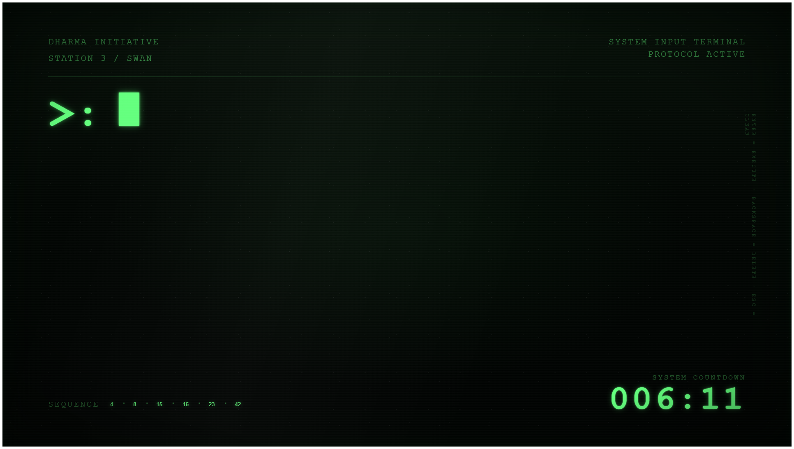
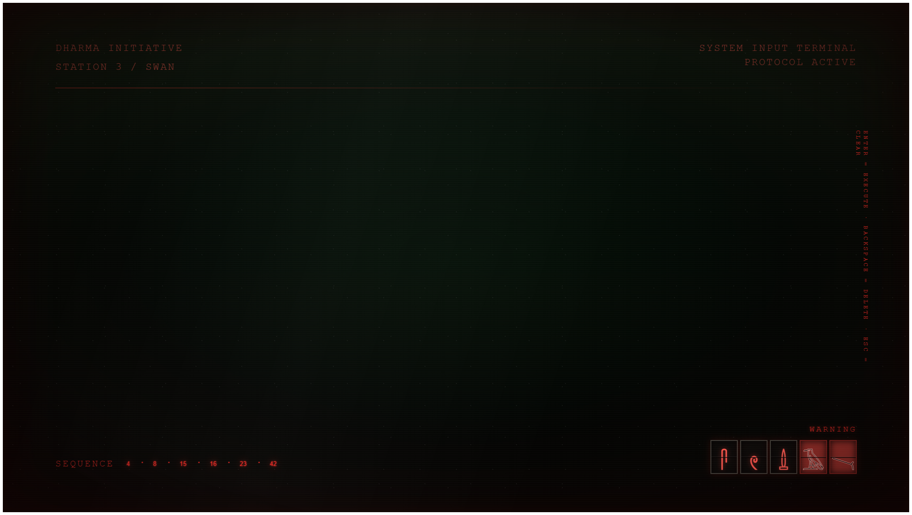

# Swan Station Terminal



A full-screen, browser-based fan recreation inspired by the **DHARMA Initiative Swan Station terminal** from *LOST*.

### System failure



The project recreates the feel of the station computer as an interactive web experience: the **108-minute countdown**, the sequence **4 · 8 · 15 · 16 · 23 · 42**, CRT phosphor styling, system-failure glyphs, layered sound design, mechanical recovery effects, and subtle randomized signal glitches.

**Live demo:** https://dharma.redroc.dev/

> **Unofficial fan project.** This project is not affiliated with, endorsed by, or sponsored by Disney, ABC, Bad Robot, or the creators/rightsholders of *LOST*. Names and concepts associated with *LOST* remain the property of their respective owners.

## What it does

- Full-screen CRT-style terminal interface
- Randomized live countdown on page load
- Correct DHARMA sequence input: `4 8 15 16 23 42`
- Countdown reset to `108:00`
- Final-minute warning state
- Five-card system-failure / hieroglyph sequence
- Right-to-left warning-card reveal
- Locked failure state followed by a `000:00 → 108:00` recovery roll-up
- Randomized CRT signal glitches
- Keyboard and clickable sequence input
- Layered ambience, alarm, key-click, monster, recovery and reset sound cues
- Responsive full-viewport layout
- SEO metadata, Open Graph, structured data, sitemap and robots.txt
- No framework, build step, backend, account system or tracking

## Technology

The entire interface is deliberately small and dependency-free:

- HTML
- CSS
- Vanilla JavaScript
- Web Audio API
- Native browser media APIs

There is no package manager and no build process.

## Run locally

Clone the repository:

```bash
git clone git@github.com:RedRocDev/swan-station-terminal.git
cd swan-station-terminal
```

Start any static web server. For example:

```bash
python -m http.server 8080
```

Then open:

```text
http://localhost:8080
```

Opening `index.html` directly will also render the interface, but serving it over HTTP is recommended for consistent browser behaviour.

### Browser audio

Modern browsers can block audible autoplay until the page receives user interaction. The terminal primes delayed sound effects after keyboard, pointer or touch interaction where possible.

## Audio assets

The production site uses several third-party sound effects sourced from Pixabay.

The **raw third-party MP3 files are intentionally not licensed under this repository's MIT License**. Check `THIRD_PARTY_NOTICES.md` before redistributing audio assets.

The visual and interaction logic still runs if audio files are absent; browsers will simply fail to load those media files.

Expected production filenames include:

```text
freesound_community-lost-stars-27849.mp3
8footdino_on_scratch-alarm-301729.mp3
the-vampires-monster-horror-orchestra-warning-338415.mp3
dragon-studio-single-key-press-393908.mp3
phoenix_connection_brazil-time-passing-sound-effect-fast-clock-108403.mp3
freesound_community-helicopter-beat-47617.mp3
freesound_community-piano-crash-sound-37898.mp3
```

## Project structure

```text
.
├── index.html
├── robots.txt
├── sitemap.xml
├── LICENSE
├── README.md
├── THIRD_PARTY_NOTICES.md
├── .gitignore
└── docs/
    └── preview.png
```

## Deployment

This is a static site. It can be hosted by any conventional static web server or platform.

The production deployment currently runs at:

**https://dharma.redroc.dev/**

No server-side application code is required.

## Design philosophy

The terminal is intentionally sparse.

The empty space, low-light phosphor treatment, restrained noise and oversized countdown are meant to make the page feel like a piece of equipment rather than a conventional website. Random glitches are deliberately brief and irregular so they register as signal instability instead of a decorative animation.

## License

Original source code in this repository is released under the **MIT License**.

That license does **not** grant rights to:

- *LOST* or its trademarks, characters, production designs or other protected material
- third-party sound effects
- third-party media or assets governed by their own licences

See `THIRD_PARTY_NOTICES.md`.

---

Built by **RedRoc**  
https://github.com/RedRocDev
